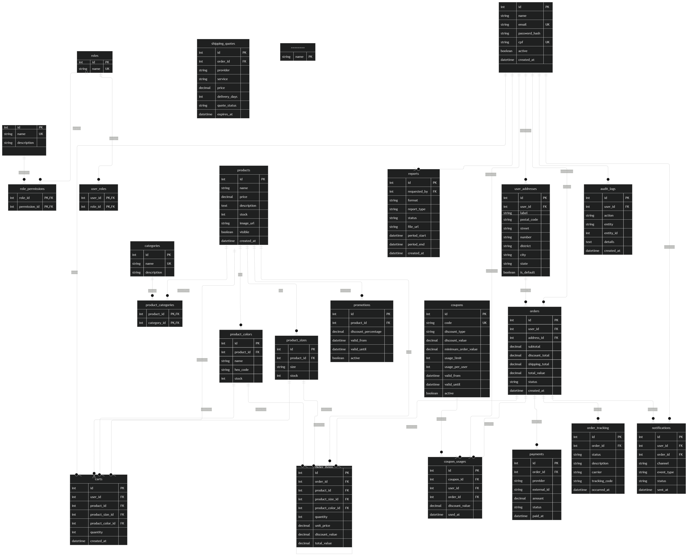

# CodeWear Mobile System

## 1. O QUE O PRODUTO POSSUI HOJE (VERSÃO 1.0)

O CodeWear é uma plataforma de comércio eletrônico composta por um aplicativo mobile em React Native com TypeScript e uma API backend em Node.js, Express, TypeScript, Sequelize e MySQL. A versão 1.0 entrega o fluxo essencial de catálogo, carrinho, checkout e administração.

### Escopo funcional entregue

- **Autenticação e perfis:** cadastro, login com JWT, persistência do token no aplicativo, rotas protegidas e separação entre Cliente e Administrador por RBAC.
- **Catálogo e detalhes:** listagem de produtos, imagens, descrição, preço, tamanhos disponíveis e estoque geral ou por tamanho.
- **Carrinho e checkout simplificado:** inclusão de produto com tamanho e quantidade, alteração de quantidade, remoção, endereço, forma de pagamento, cálculo do valor e criação do pedido.
- **Pedidos do cliente:** consulta do histórico com itens, data, valor, endereço, forma de pagamento e status armazenado.
- **Painel administrativo:** indicadores de vendas, consulta de pedidos e clientes, gestão de produtos, estoque, tamanhos e registros de auditoria.
- **Desconto direto:** desconto global da loja ou desconto vinculado a um produto/item, com percentual, vigência e ativação. Não existe digitação ou validação de cupom na versão 1.0.

### Requisitos Funcionais Atuais (RFs v1.0)

- **RF-01:** O sistema deve permitir o cadastro de clientes com dados pessoais e credenciais.
- **RF-02:** O sistema deve autenticar usuários por JWT e diferenciar Cliente e Administrador por permissões RBAC.
- **RF-03:** O sistema deve permitir consultar produtos visíveis, detalhes, imagens, tamanhos e disponibilidade de estoque.
- **RF-04:** O sistema deve permitir que o administrador cadastre, edite, oculte produtos e administre seus preços, imagens e estoques.
- **RF-05:** O sistema deve permitir que o administrador cadastre estoques independentes por tamanho quando aplicável.
- **RF-06:** O sistema deve permitir que o cliente adicione produtos e tamanhos ao carrinho, altere quantidades e remova itens.
- **RF-07:** O sistema deve calcular o preço considerando o desconto direto individual ativo ou, na ausência dele, o desconto global ativo.
- **RF-08:** O sistema deve permitir que o cliente finalize a compra informando endereço e forma de pagamento.
- **RF-09:** O backend deve validar estoque, criar pedido e itens, baixar estoque e limpar o carrinho dentro do checkout.
- **RF-10:** O sistema deve permitir que o cliente consulte seus pedidos e que o administrador consulte as vendas realizadas.
- **RF-11:** O sistema deve permitir que o administrador consulte indicadores de faturamento, pedidos e clientes.
- **RF-12:** O sistema deve registrar e disponibilizar eventos de auditoria de operações administrativas relevantes.

### Requisitos Não Funcionais Atuais (RNFs v1.0)

- **RNF-01 - Arquitetura:** o backend deve manter separação entre rotas, controllers, models, middlewares e utilitários, com o mobile consumindo a API por HTTP.
- **RNF-02 - Segurança:** endpoints protegidos devem exigir Bearer Token JWT, validação de credenciais e autorização RBAC para operações administrativas.
- **RNF-03 - Persistência:** os dados devem ser armazenados em MySQL por meio do Sequelize, preservando relacionamentos entre usuários, produtos, carrinho, pedidos e itens.
- **RNF-04 - Integridade:** o checkout deve usar transação para evitar pedido parcialmente criado quando ocorrer falha de validação ou estoque.
- **RNF-05 - Usabilidade:** o aplicativo deve apresentar estados de carregamento, mensagens de erro e fluxos compatíveis com dispositivos móveis.
- **RNF-06 - Manutenibilidade:** backend e mobile devem ser implementados em TypeScript e possuir testes automatizados para regras e controllers prioritários.
- **RNF-07 - Auditoria:** operações administrativas de catálogo devem ser rastreáveis por usuário, ação e detalhes da alteração.
- **RNF-08 - Compatibilidade:** a API deve aceitar conexões do aplicativo mobile em ambiente de desenvolvimento por endereço configurável.

---

## PERSONA E CONTEXTO DE NEGÓCIO

### O Problema do Negócio (Visão do Lojista)
O CodeWear nasceu da necessidade do idealizador da marca em atingir um público altamente segmentado: profissionais e entusiastas da área de Tecnologia da Informação (TI). Vender camisetas com estampas personalizadas de programação, memes de código, sintaxes e cultura tech através de uma loja física local inviabilizava o negócio devido ao alcance geográfico restrito e à pulverização desse público na região. A criação de uma plataforma e-commerce mobile própria tornou-se indispensável para escalar as vendas, centralizar o catálogo e conectar a marca diretamente à comunidade dev em nível nacional.

### Persona do Cliente Ideal

**Nome:** Alex "Dev" Silva  
**Perfil:** Desenvolvedor de Software / Profissional da Área de Tecnologia  
**Faixa Etária:** 18 a 55 anos (Abrangendo desde estudantes e estagiários até desenvolvedores seniores e especialistas)  

#### Dores e Necessidades
- **Dificuldade de Encontrar Roupas Temáticas com Qualidade:** Lojas genéricas de departamento não possuem produtos que expressem a identidade e o orgulho de trabalhar com tecnologia, ou oferecem estampas genéricas e de baixa qualidade.
- **Geografia Limitada:** Falta de lojas físicas locais focadas na cultura geek/tech na sua região de residência.
- **Falta de Clareza nas Variações:** Frustração ao comprar vestuário online por falta de especificidades sobre cortes, tamanhos de estoque real por variação (P, M, G, GG) e cores disponíveis.
- **Exigência por Experiência Digital Fluida:** Por ser um usuário avançado de tecnologia, possui baixa tolerância para aplicativos lentos, interfaces poluídas, fluxos de checkout burocráticos ou falta de acompanhamento do pedido.

#### Solução Entregue pelo CodeWear
- **Catálogo Segmentado:** Vitrine de produtos totalmente voltada à cultura de programação e desenvolvimento de software.
- **Experiência Mobile First e Fluida:** Aplicativo nativo em React Native com interface limpa, navegação rápida, suporte a variantes de produto e carrinho simplificado.
- **Transparência Transacional e Logística:** Gestão precisa de estoque por tamanho/cor, transparência no resumo de preços/descontos e arquitetura preparada para rastreamento de entregas em tempo real.

---

## 2. O QUE O PRODUTO TERÁ NA VERSÃO 2.0 (EVOLUÇÃO E MODIFICAÇÕES FUTURAS)

A versão 2.0 evoluirá o sistema integrado atual para uma arquitetura modular unificada, com módulos de identidade, catálogo, promoções, carrinho e checkout, pedidos, logística, pagamentos, notificações, relatórios e auditoria. Os contratos entre os módulos serão explícitos, as regras de negócio ficarão no backend e as integrações externas serão protegidas por adaptadores, filas e políticas de timeout.

- **Motor de Cupons de Desconto:** cadastro de código promocional, percentual ou valor fixo, vigência, valor mínimo, limite total, limite por cliente, produtos elegíveis, ativação, auditoria e revalidação transacional no checkout.
- **Variantes Avançadas de Produtos:** cores, tamanhos e combinações de variantes com estoque independente, seleção no detalhe, carrinho e checkout.
- **Múltiplos Endereços e Logística:** cadastro de endereços do cliente, seleção do endereço do pedido e cálculo de frete por CEP, origem, destino, peso e dimensões.
- **Rastreamento em Tempo Real:** histórico de eventos, linha do tempo, transportadora, código de rastreio, atualização por WebSocket ou Socket.IO e sincronização ao reconectar.
- **Gateway de Pagamento Real:** autorização, captura, recusas, estorno, webhooks idempotentes e transições automáticas entre estados de pagamento e pedido.
- **Notificações Transacionais:** envio automatizado por e-mail e/ou WhatsApp para pagamento, expedição, alteração de status, entrega, cancelamento e falhas.
- **Relatórios Financeiros:** filtros por período, status, forma de pagamento, produto e promoção, com exportação em PDF e XLSX e registro da solicitação.
- **Categorias e banco de dados:** categorias normalizadas, relacionamento N:N entre produtos e categorias, migrations versionadas, constraints, índices e preparação para alta escala.

---

## 3. LISTA DE NOVAS FUNCIONALIDADES E MELHORIAS DO E-COMMERCE

- **Automação Logística:** cotação dinâmica de frete, seleção de serviço, etiqueta ou código de rastreio, eventos de transporte e fallback quando o parceiro estiver indisponível.
- **Marketing e Fidelização:** cupons com regras de elegibilidade, limites de uso, campanhas por período, produto ou categoria e histórico de impacto comercial.
- **Experiência do Cliente e UX:** seleção de cores e tamanhos combinados, múltiplos endereços, resumo oficial de preço e frete, notificações transacionais e timeline do pedido.
- **Gestão Executiva:** relatórios financeiros avançados, indicadores de margem e descontos, exportação auditável e banco normalizado para consultas confiáveis em escala.

---

## 4. REQUISITOS FUNCIONAIS FUTUROS (RFs v2.0)

- **RF-F01 - Cupons:** permitir cadastrar, editar, ativar, desativar e validar cupons por código, tipo de desconto, valor, vigência, valor mínimo, limite total, limite por cliente e produtos ou categorias elegíveis.
- **RF-F02 - Variantes de cores:** permitir cadastrar cores e combinações de cor e tamanho, selecionar uma variante no produto e reservar seu estoque específico no carrinho e checkout.
- **RF-F03 - Endereços:** permitir cadastrar, editar, selecionar e excluir múltiplos endereços de entrega, mantendo um snapshot do endereço usado em cada pedido.
- **RF-F04 - Frete dinâmico:** consultar serviços logísticos por CEP, origem, destino, peso e dimensões, retornando opções de preço e prazo para o checkout.
- **RF-F05 - Rastreamento:** registrar eventos de envio e disponibilizar ao cliente status atual, linha do tempo, transportadora e código de rastreio em tempo real ou por consulta sincronizada.
- **RF-F06 - Pagamento real:** integrar gateway para autorização, captura, cancelamento, estorno e recebimento de webhooks, atualizando automaticamente o estado do pagamento e do pedido.
- **RF-F07 - Notificações:** enviar notificações transacionais por e-mail e/ou WhatsApp, controlar preferências do cliente e registrar entrega, falha e reprocessamento.
- **RF-F08 - Relatórios:** permitir ao administrador gerar, consultar e exportar relatórios financeiros em PDF e XLSX por período, status, pagamento, produto, categoria e promoção.

---

## 5. REQUISITOS NÃO FUNCIONAIS FUTUROS (RNFs v2.0)

- **RNF-F01 - Desempenho:** cotações de frete, consultas de rastreamento e validações de cupom devem responder em até 1,5 segundos no percentil definido, com cache TTL quando aplicável.
- **RNF-F02 - Concorrência:** uso simultâneo de cupons e estoque deve utilizar transações, locks atômicos ou operações condicionais para impedir dupla utilização, overselling e inconsistências.
- **RNF-F03 - Disponibilidade:** integrações externas devem possuir timeout, retry limitado, circuit breaker e fallback gracioso, preservando o pedido e informando o cliente quando o parceiro estiver indisponível.
- **RNF-F04 - Segurança e RBAC:** cupons, pagamentos, endereços e relatórios devem exigir autorização por papel, validação no servidor, proteção contra replay, idempotência e ausência de dados sensíveis em logs.
- **RNF-F05 - Escalabilidade:** tarefas de notificação, webhooks, rastreamento e relatórios devem ser processadas por filas; Redis poderá prover cache, rate limiting e locks distribuídos.
- **RNF-F06 - Observabilidade:** a plataforma deve possuir logs estruturados, correlation ID, métricas, traces, alertas e auditoria das transições de pedido e chamadas a parceiros.
- **RNF-F07 - Qualidade e evolução:** o banco deve usar migrations versionadas, índices e constraints; a API deve possuir contratos documentados e testes unitários, integração e ponta a ponta.
- **RNF-F08 - Privacidade:** o tratamento de dados deve atender à LGPD, com minimização, controle de acesso, retenção definida, anonimização quando aplicável e fluxo auditável de cancelamento.

### Operação atual

O backend é executado a partir do diretório `Backend-CodeWear` e o aplicativo a partir de `Mobile-CodeWear`. A instalação das dependências e a inicialização devem seguir os scripts `npm` existentes em cada projeto. A porta padrão da API é 3000, e o aplicativo deve apontar para um endereço acessível pelo dispositivo ou emulador.

---

## DIAGRAMAS DA ARQUITETURA (V2.0)

### Modelo de Dados

### Casos de Uso
#### Visão do Cliente

#### Visão do Administrador

### Diagramas de Atividade
#### Validação de Cupom

#### Rastreamento em Tempo Real

### Diagramas de Sequência
#### Fluxo de Checkout v2.0

#### Relatório Financeiro
